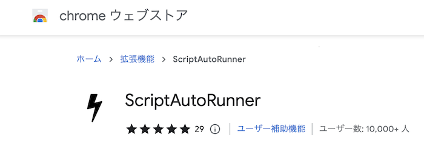
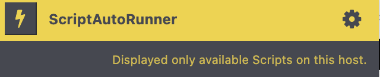
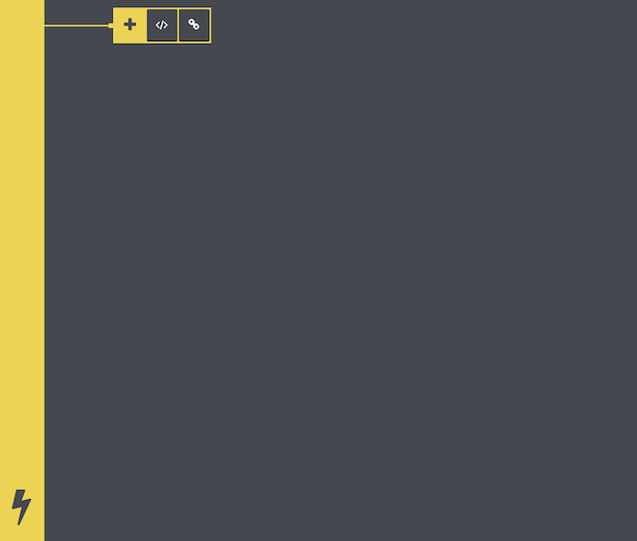
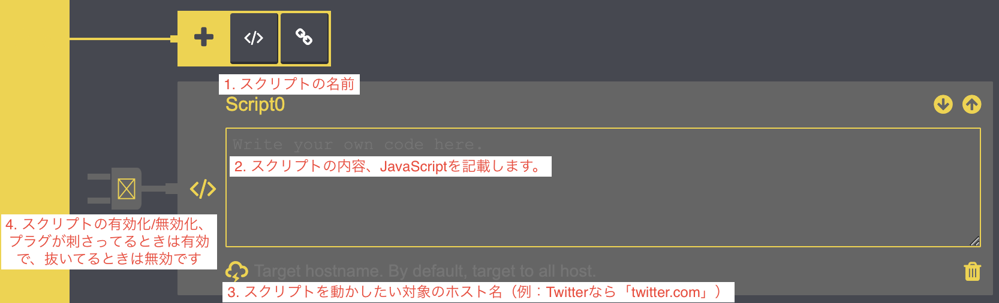
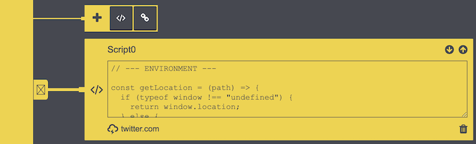

# ScriptAutoRunner PC 向け関連ツイート非表示スクリプト

最近 Twitter で導入された関連ツイートを非表示にしたいというモチベーションで作成しました。  
作者は基本的に PC のブラウザ版で Twitter を使用しているため、今回は ScriptAutoRunner という Chrome 拡張を利用しブラウザで Twitter を開くたびに関連ツイートを非表示にするようにしています。

## ScriptAutoRunner 導入

### Chrome

前提として PC 版になるため、まずは Google Chrome をインストールしてください。

### ScriptAutoRunner 拡張プラグイン

続いてこの URL にアクセスし ScriptAutoRunner の拡張プラグインを導入します。  
https://chrome.google.com/webstore/detail/scriptautorunner/gpgjofmpmjjopcogjgdldidobhmjmdbm?hl=ja

## スクリプトのセットアップ

拡張プラグインである ScriptAutoRunner をプラグインの一覧から選択しましょう。

Google Chrome の下記アイコンから一覧を開くことができます。

ScriptAutoRunner を選択すると UI が表示されるので、

歯車のアイコンを選択するとスクリプト編集画面が表示されます。

この黄色い四角の＋の中にある、 `</>` と書かれたボタンを押すと `Script0` が作成されます。

スクリプトには画像に説明している項目を設定しておく必要があります。

| 項目                  | 説明                                                            |
| --------------------- | --------------------------------------------------------------- |
| 1. スクリプトの名前   | 好きな名前を指定しましょう。                                    |
| 2. スクリプトの内容   | Web ページを開いたときに発火させたい JavaScript を記載します。  |
| 3. ホスト名           | スクリプトを発火させたい対象の Web ページのホストを指定します。 |
| 4. スクリプトの有効化 | スクリプトを動かしたいときは有効にします。                      |

### 1. スクリプトの名前

デフォルトだと作成した順番に Script 0,1,2,3... となります。  
もし気になる場合は名前を付けましょう。

### 2. スクリプトの内容

JavaScript を記述しますが、今回は関連ツイート非表示用のスクリプトがあるためそちらを指定していきます。  
https://raw.githubusercontent.com/O6lvl4/sar-twitter-related-tweet-blocker/main/main.js

この URL にアクセスしてスクリプトのテキストを全てコピーしておきます。  
コピーした内容をそのままスクリプトの内容としてペーストすればスクリプト自体の設定は完了です。

### 3. ホスト名

2 の時点でスクリプトは動作するようになりますが、このままだと全ての Web ページで動作してしまいます。  
そうならないようにスクリプトを動かしたい Web ページを限定していきます。  
今回は Twitter の関連ツイートだけを非表示にしたいので、 `twitter.com` を入力しておきます。

### 4. スクリプトの有効化

あとは動作させるために有効化していきたいので、UI 上に見えているプラグを選択します。  
それによってプラグの色が黒から黄色に変われば有効化された状態になります。

## 動作確認

スクリプトを設定するとこのような見た目になっています。

これで Twitter を開くと自動的に関連ツイートを非表示にしてくれます。
